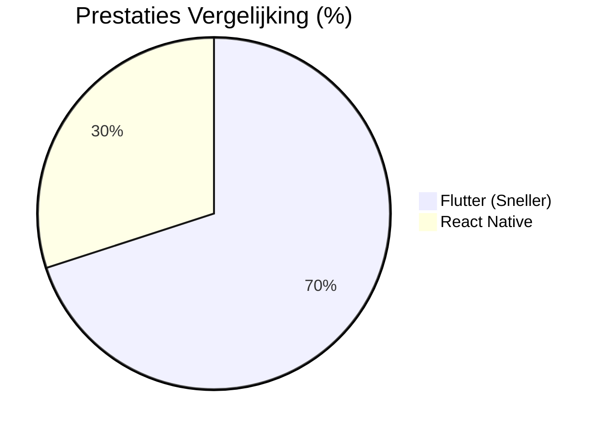
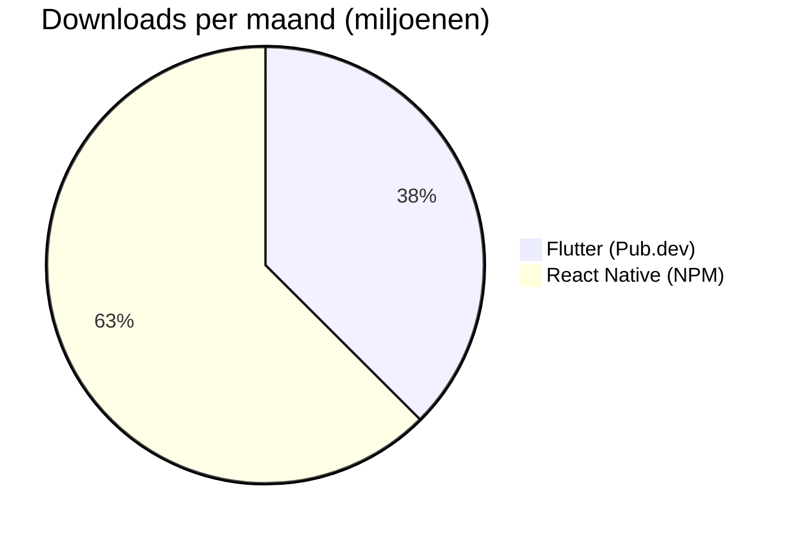
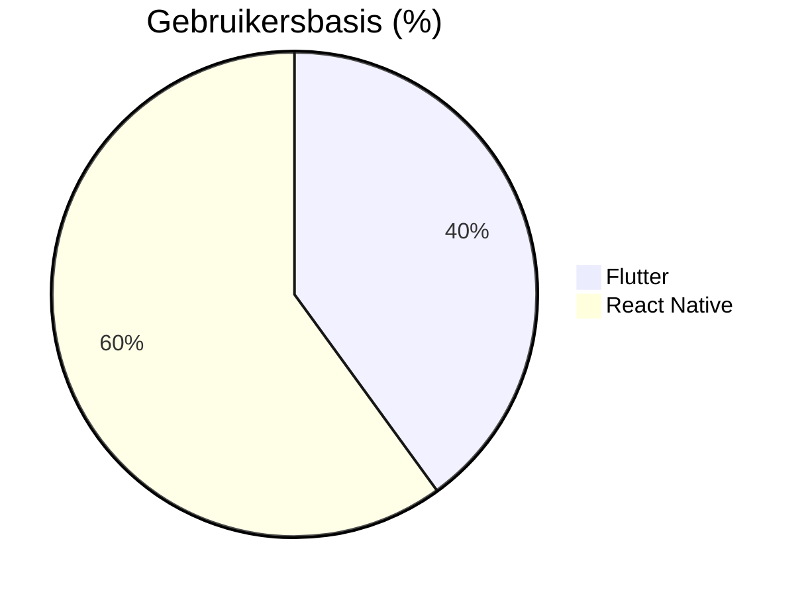
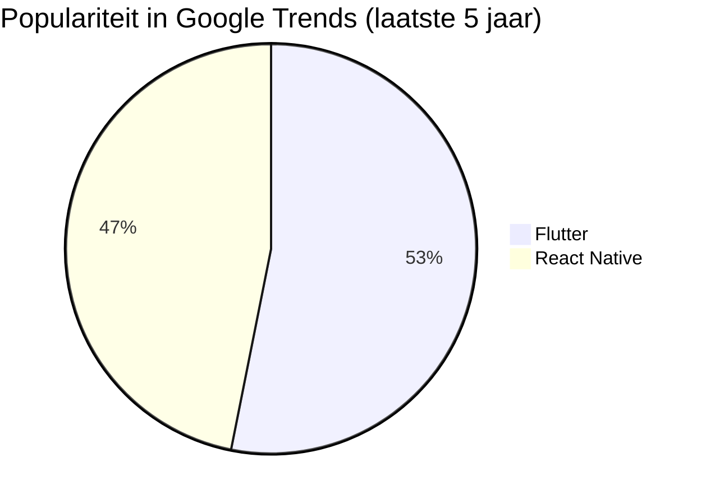

# Flutter Installatie Guide

## Flutter Installeren

1. Ga naar de officiële Flutter website: https://docs.flutter.dev/get-started/install
2. Kies je besturingssysteem (voor deze guide zal ik Windows kiezen).
3. Kies dan Android.
4. Download de Flutter zip file:

   

5. Unzip de file en knip en plak hem in je C: Drive.
6. Navigeer naar de Flutter file -> navigeer naar bin en kopieer je path. Dit zou normaal "C:/flutter/bin" moeten zijn.
7. Zoek nu op jouw systeem naar "Environment Variables" en klik op **Edit the system environment variables**.
8. Klik op de **Environment Variables** knop:

   

9. Ga naar **Path** in **User variables for "User"** en klik op **Edit**:

   

10. Klik op **New** en plak het eerder gekopieerde path.

## Android Studio Installeren

1. Ga naar de officiële website van Android Studio: https://developer.android.com/studio
2. Download Android Studio en volg het installatieproces (het is belangrijk dat **Android SDK**, **Android SDK Platform** en **Android Virtual Device** allemaal zijn aangevinkt).

# Flutter vs React Native

## Inleiding

Flutter en React Native zijn twee populaire frameworks voor cross-platform mobiele app-ontwikkeling. Dit document vergelijkt hun voor- en nadelen en visualiseert enkele belangrijke verschillen.

---

## 📊 Vergelijkingstabel

| Kenmerk                 | Flutter                              | React Native                                 |
| ----------------------- | ------------------------------------ | -------------------------------------------- |
| **Taal**          | Dart                                 | JavaScript (met TypeScript-ondersteuning)    |
| **UI-rendering**  | Eigen rendering-engine (Skia)        | Gebruikt native componenten                  |
| **Prestaties**    | Zeer snel (gecompileerd naar native) | Goed, maar afhankelijk van brug naar native  |
| **Community**     | Groeiende, maar kleiner              | Groot en goed ondersteund                    |
| **Ecosysteem**    | Minder packages dan React            | Zeer veel packages & community-ondersteuning |
| **Leercurve**     | Hoger (Dart is minder bekend)        | Lager (JavaScript is populair)               |
| **Ondersteuning** | Google                               | Meta (Facebook)                              |

---

## ✅ Voordelen van Flutter

- **Eigen rendering-engine** → Consistente UI op alle platforms.
- **Hoge prestaties** → Compileert naar native ARM-code.
- **Hot Reload** → Snel testen en itereren.
- **Sterke UI-bibliotheken** → Veel ingebouwde widgets.

## ❌ Nadelen van Flutter

- **Grote app-grootte** → Meer opslag nodig dan React Native.
- **Minder community support** → Kleiner ecosysteem dan React Native.
- **Leercurve** → Dart is minder populair dan JavaScript.

---

## ✅ Voordelen van React Native

- **Grote community** → Veel support en packages.
- **Snellere ontwikkeling** → Bekend ecosysteem met JavaScript en TypeScript.
- **Native performance** → Gebruikt native componenten waar mogelijk.

## ❌ Nadelen van React Native

- **Brug naar native code** → Kan prestatieproblemen veroorzaken.
- **UI-inconsistenties** → Afhankelijk van native componenten.
- **Upgrades kunnen lastig zijn** → Sommige updates breken compatibiliteit.

---

## 📉 Prestatiesvergelijking

## 📥 Vergelijking van Downloads (NPM vs Pub.dev)

